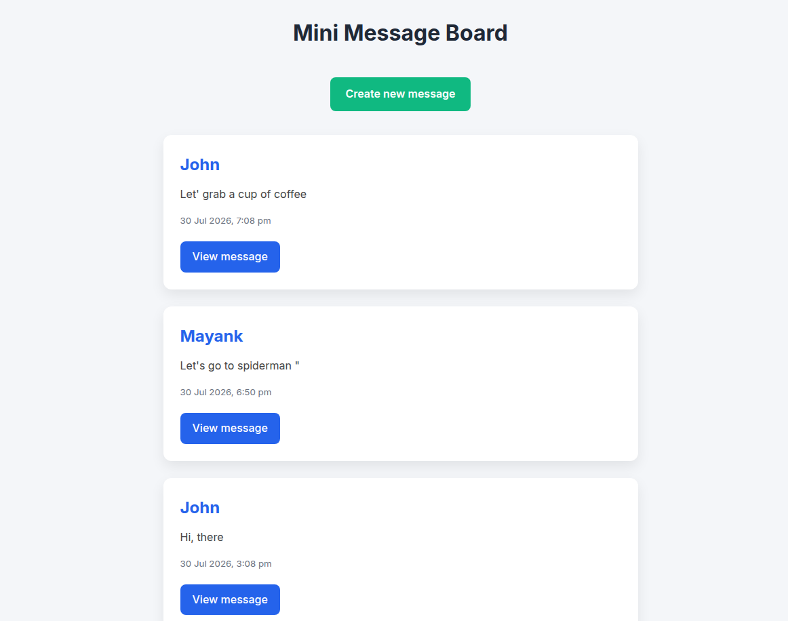
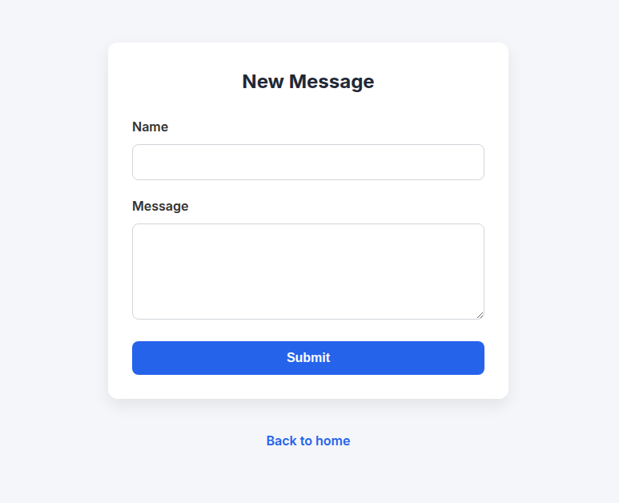

# Mini Message Board

A simple message board application built with **Node.js**, **Express.js**, **PostgreSQL**, and **EJS**. Users can view all messages, create new messages, and view individual message details. Messages are stored in a PostgreSQL database, so they persist even after the server restarts.

---

## 🚀 Live Demo

https://mini-message-board-5cq4.onrender.com/

---

## Screenshots

### Home Page



### Create Message



---

## Features

* View all messages on the home page
* Create a new message using a form
* View details of an individual message
* Persistent data storage using PostgreSQL
* Server-side form validation with Express Validator
* User input is preserved when validation fails
* Dynamic server-side rendering with EJS
* Clean and responsive UI
* MVC architecture
* Parameterized SQL queries for improved security

---

## Tech Stack

* Node.js
* Express.js
* PostgreSQL
* pg
* Express Validator
* EJS
* HTML5
* CSS3

---

## Project Structure

```text
mini-message-board/
│
├── controllers/
│   └── messageController.js
│
├── models/
│   └── messageModel.js
│
├── routes/
│   └── indexRouter.js
│
├── db/
│   └── pool.js
│
├── views/
│   ├── index.ejs
│   ├── form.ejs
│   └── messageDetails.ejs
│
├── public/
│   └── styles.css
│
├── db/
│   └── populatedb.js
│
├── assets/
├── app.js
├── package.json
├── .env
├── validate.js
└── README.md

```

---

## Installation

### 1. Clone the repository

```bash
git clone <repository-url>
```

### 2. Navigate to the project directory

```bash
cd mini-message-board
```

### 3. Install dependencies

```bash
npm install
```

### 4. Create a `.env` file

Add your PostgreSQL connection string:

```env
DB_URL=your_postgresql_connection_string
```

---

### 5. Seed the database

```bash
node db/populatedb.js
```

This creates the required table and inserts sample messages.

---

### 6. Start the server

```bash
node app.js
```

or, if using nodemon:

```bash
npm run dev
```

---

## Usage

Open your browser and visit:

```text
http://localhost:3000
```

You can:

* Browse all messages
* Create a new message
* View an individual message

---

## Routes

| Method | Route           | Description               |
| ------ | --------------- | ------------------------- |
| GET    | `/`             | Display all messages      |
| GET    | `/new`          | Show the new message form |
| POST   | `/new`          | Create a new message      |
| GET    | `/messages/:id` | Display a single message  |

---

## Database Schema

### messages

| Column     | Type         |
| ---------- | ------------ |
| id         | INTEGER      |
| username   | VARCHAR(255) |
| text       | TEXT         |
| created_at | TIMESTAMP    |

---

## Validation

The application validates user input on the server using **Express Validator**.

### Username

* Required
* Minimum length of 2 characters

### Message

* Required

If validation fails:

* The form is re-rendered.
* Validation errors are displayed.
* Previously entered values are preserved.

---

## Learning Objectives

This project helped reinforce the following backend concepts:

* Express application setup
* MVC architecture
* Express routing
* GET and POST requests
* Route parameters
* Middleware
* Server-side rendering with EJS
* PostgreSQL integration using `pg`
* Connection pooling
* Environment variables
* Database seeding
* Parameterized SQL queries
* Express Validator
* Input sanitization with `matchedData()`
* Server-side form validation

---

## Future Improvements

* Edit existing messages
* Delete messages
* User authentication
* Pagination
* Search functionality
* Better timestamp formatting
* Field-level validation messages
* Centralized error handling

---

## License

This project was built for learning purposes as part of **The Odin Project** backend curriculum.
